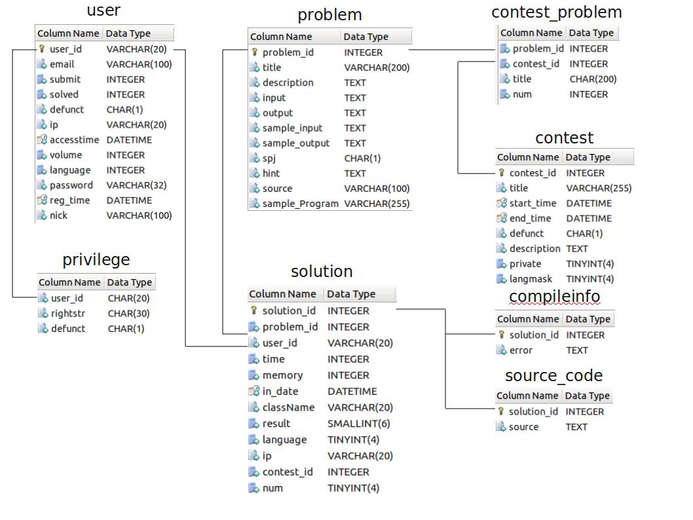

# Core 与 Web 的连接方式解析

### 简化 ER 图

### 数据库连接（默认）

1. `Web` 插入 `Solution` 表。
2. `core` 轮询 `solution` 表，发现新记录。
3. `core` 更新 `solution` 表 `result` 等字段
4. `Web` 端轮询 `soltuion` 显示 `result` 等字段。

### HTTP 方式连接

1. `Web` 插入 `Solution` 表
2. `core` 访问 `Web` 端 `admin/problem_judge.php` ，发现新纪录
3. `core` 向 `Web` 端 `admin/problem_judge.php` 提交数据，`problem_judge.php` 更新 `solution` 表 `result` 等字段。
4. `Web` 端轮询 `soltuion` 显示 `result` 等字段。

