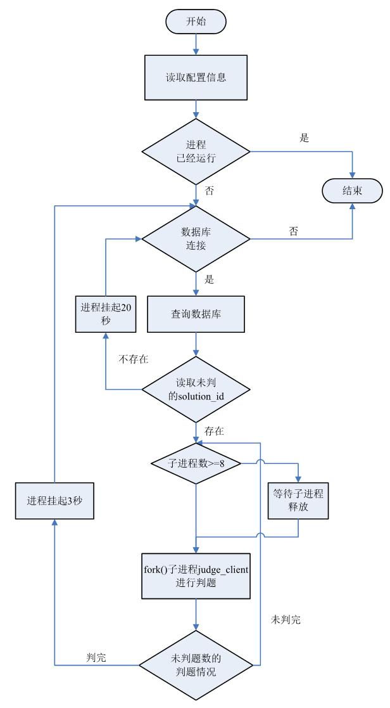
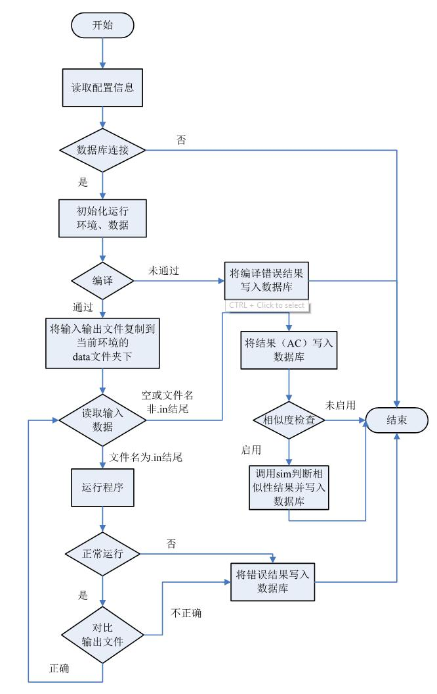

# Core 解析

`core` 分 `3` 部分，`judged` 、 `judge_client` 、 `sim` 。源码解读：[点我](/Compostition-Code)

### judged 解析

#### 简介

`judged` 为服务进程， `d` 即 `daemon`。负责轮询数据库或 `web` 端，提取判题队列。单个主机运行多个 `judged` ，分别负责不同的 `OJ` 判题。

#### 基本参数

judged 可以接受一个参数作为自己的主目录，默认是 `/home/judge/` 。如： `sudo judged /home/judge/local`

不指定参数将自动以单进程运行。当指定的参数不为/home/judge 时，就会有多个进程出现。

每个主目录可以有自己的 `etc/judge.conf` 数据目录可以共享，runX 目录需要独立。

#### judged 调试模式

judged 接受参数指定目录的情况下，还可以再接受一个 `debug` 作为调试模式开关。如：`sudo judged /home/judge/local debug` 调试模式的 `judged` 将不会进入后台，并且将输出大量调试信息，其调用的 `judge_client` 也工作在 `debug` 模式。
### judge_client 解析

#### 简介

当发现新任务时产生 `judge_client` 进程。

`judge_client` 进程为实际判题程序，负责准备运行环境、数据，运行并监控目标程序的系统调用，采集运行指标，判断运行结果。

#### 后台安全机制

在UNIX 中有上百个[系统调用](http://www.ibm.com/developerworks/cn/linux/kernel/syscall/part1/appendix.html)，有一大部分是在用户程序运行过程中不需要的，比如说 `mkdir` `mount` 等，还有一部分会对系统造成安全隐患的，比如`fork` `kill` `exec` 等，还有一些比如 `socket` 等会造成敏感信息，比如测试数据的泄漏等。因为以上情况的存在，所以需要在运行用户程序的时候对用户加以限制，`linux` 下的 `ptrace` 在这里是一个非常好用的工具，它可以在用户态和内核态之间切换之前和之后，将进程暂停，以方便控制进程的处理，控制进程通过 `ptrace` 可以读取到当前进程想要去做什么，这样就可以在用户程序造成破坏之前将程序中止。限制非法系统调用，最好的办法是使用白名单机制，只允许程序使用一个小集合里的调用，对于其它调用，即使它是安全的，也不会被允许，比如 `mkdir` 。由于 `Pascal` `Java` `C/C++`的机制有些区别，因此，三种不同语言的白名单各不相同。

#### judge_client 调试模式

`judge_client [工作主目录] [调试]`

如：`judge_client 2001 5 /home/judge/demo debug`

将在 `/home/judge/demo/run5` 目录中对 `2001` 号提交进行重判，并打开调试模式，输出大量调试信息，运行后不删除中间结果。

这个模式可以帮助调试题目数据，发现数据问题和了解提交 RE 的详细错误原因。

### sim 简介

当配置为启用抄袭检查时， `judge_client` 将调用 `sim`，判断相似性结果，并写回数据库或 `web` 端。

`sim` 为第三方应用程序， 可进行语法分析判断文本相似度， 通过检验的程序将由 `judge_client` 复制进题目数据的 `ac` 目录，成为新的参考样本。

### 配置文件注释

配置文件： `judge.conf` 。

配置                       |                      注释
-------------------------  |  ------------------------------------------
`OJ_HOST_NAME=127.0.0.1`   |  如果用 mysql 连接读取数据库，数据库的主机地址。
`OJ_USER_NAME=root`        |  数据库帐号。
`OJ_PASSWORD=root`         |  数据库密码。
`OJ_DB_NAME=jol`           |  数据库名称。
`OJ_PORT_NUMBER=3306`      |  数据库端口。
`OJ_RUNNING=4`             |  `judged` 会启动 `judge_client` 判题，这里规定最多同时运行几个 `judge_client`。
`OJ_SLEEP_TIME=5`          |  `judged` 通过轮询数据库发现新任务，轮询间隔的休息时间，单位为秒。
`OJ_TOTAL=1`               |  老式并发处理中总的 `judged` 数量。
`OJ_MOD=0`                 |  老式并发处理中，本 `judged` 负责处理 `solution_id` 按照 `TOTAL` 取模后余数为几的任务。
`OJ_JAVA_TIME_BONUS=2`     |  Java 等虚拟机语言获得的额外运行时间。
`OJ_JAVA_MEMORY_BONUS=512` |  Java 等虚拟机语言获得的额外内存。
`OJ_SIM_ENABLE=0`          |  是否使用sim 进行代码相似度的检测。
`OJ_HTTP_JUDGE=0`          |  是否使用 `HTTP` 方式连接数据库，如果启用，则前面的 `HOST_NAME` 等设置忽略。
`OJ_HTTP_BASEURL=http://127.0.0.1/`  |  使用 `HTTP` 方式连接数据库的基础地址，就是 `OJ` 的首页地址。
`OJ_HTTP_USERNAME=admin`   |  使用 `HTTP` 方式所用的用户帐号（`HTTP_JUDGE` 权限），该帐号登录时不能启用 `VCODE` 图形验证码，但可以登录成功后启用。
`OJ_HTTP_PASSWORD=admin`   |  使用 `HTTP` 方式所用的用户帐号的密码
`OJ_OI_MODE=0`             |  是否启用 `OI（信息学奥林匹克竞赛）` 模式，即无论是否出错都继续判剩余的数据，在 `ACM` 比赛中一旦出错就停止运行。
`OJ_SHM_RUN=0`             |  是否使用 `/dev/shm` 的共享内存虚拟磁盘来运行答案，如果启用能提高判题速度，但需要较多内存。
`OJ_USE_MAX_TIME=1`        |  是否使用所有测试数据中最大的运行时间作为最后运行时间，如果不启用则以所有测试数据的总时间作为超时判断依据。
`OJ_LANG_SET=0,1,2,3,4`    |  判哪些语言的题目
`OJ_COMPILE_CHROOT=1`      |  是否使用chroot构建编译环境，避免编译器攻击 (#include</dev/random>之类)
`OJ_TURBO_MODE=0`          |  是否跳过中间状态的更新来加速判题（对增加判题机数量有帮助）
`OJ_CPU_COMPENSATION=1.0`  |  CPU处理能力系数，如果CPU太快，应该TLE的程序能AC，则增大这个值；如果CPU太慢对应该AC的程序报TLE减小这个值。一般设定MIPS指数4000的CPU设为1.0。
`OJ_UDP_ENABLE=1`          |  是否监听UDP端口已收取Web端发送的新提交通知，减少平均等待周期。
`OJ_UDP_SERVER=127.0.0.1`  |  监听的IP地址
`OJ_UDP_PORT=1536`         |  监听的端口
`OJ_PYTHON_FREE=0`         |  是否允许Python程序调用非核心的三方库
`OJ_COPY_DATA=0`           |  是否将测试数据复制到runX工作目录中供被测程序使用
