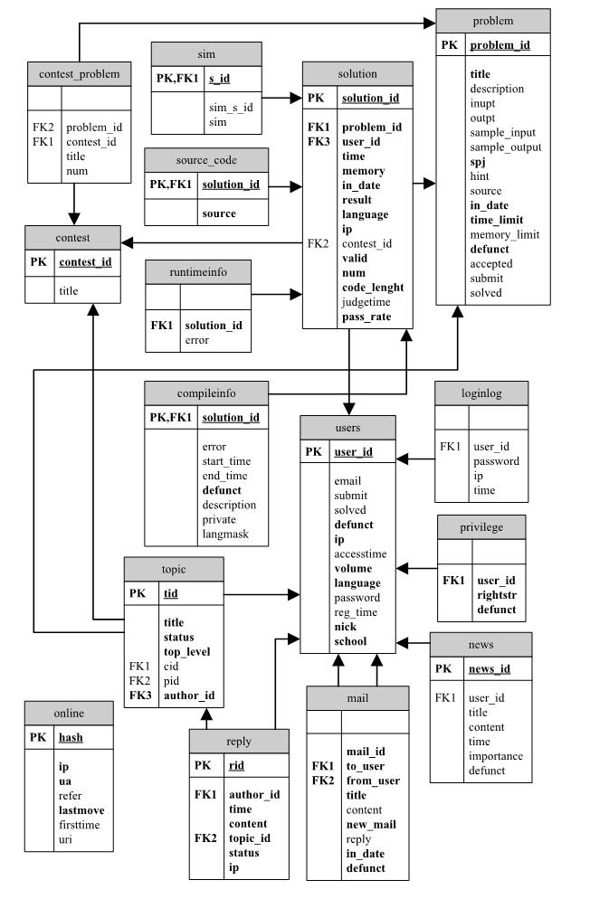

# 数据库解析

### 数据库关系图

### 数据库表分析

序号  |         表名        |         作用            |  备注
----  |  -----------------  |  --------------------  |  --------------------
1     |  `compileinfo`      |  记录编译错误的记录      |
2     |  `contest`          |  竞赛表                 | 
3     |  `contest_problem`  |  竞赛题目               |
4     |  `loginlog`         |  登入日志               |  记录正确与错误的登入日志 
5     |  `mail`             |  消息列表              | 
6     |  `news`             |  新闻表                | 
7     |  `online`           |  用户在线数据统计       | 
8     |  `privilege`        |  权限授予               |
9     |  `problem`          |  题目表                |
10    |  `reply`            |  论坛（帖子及回复）表    |
11    |  `runtimeinfo`      |  运行错误信息           |
12    |  `sim`              |  相似度检测表            |  用于防作弊
13    |  `solution`         |  程序运行结果记录        | 
14    |  `source_code`      |  提交的源码             |
15    |  `topic`            |  论坛帖子表             |
16    |  `users`            |  用户信息               |
17    |  `custominput`      |  用于在线IDE            |

### 数据库表详解

**`compileinfo` - 记录编译错误的提交号（`id`）及原因**

字段名         |  类型  |  长度  |  是否允许为空  |  备注
------------- | ------ | --     | ------------- | ------------
`solution_id` | `int`  | 11     | N             | 主键（提交id，即RunID）
`error`       | `text` | -      | Y             | 编译错误原因

**`contest` - 竞赛表**

字段名         | 类型       | 长度 | 是否允许为空 | 备注
------------- | ---------- | ---- | ----------- | ---
`contest_id`  | `int`      | 11   | N           | 竞赛id（主键）
`title`       | `varchar`  | 255  | Y           | 竞赛标题
`start_time`  | `datetime` | -    | Y           | 开始时间(年月日时分)
`end_time`    | `datatime` | -    | Y           | 结束时间(年月日时分)
`defunct`     | `char`     | 1    | N           | 是否屏蔽（Y/N）
`description` | `text`     | -    | Y           | 描述（在此版本中未用）
`private`     | `tinyint`  | 4    | -           | 公开/内部（0/1）
`langmask`    | `int`      | 11   | -           | 语言

**`contest_problem` - 竞赛题目**

字段名       |  类型   |  长度 | 是否允许为空 | 备注
------------ | ------ | ----- | ----------  | ---
`problem_id` | `int`  | 11    | N           | 题目id
`contest_id` | `int`  | 11    | Y           | 竞赛id
`title`      | `char` | 200   | N           | 标题
`num`        | `int`  | 11    | N           | 竞赛题目编号

**`loginlog` - 登入日志（不管是否登入成功都记录）**

字段名     | 类型        | 长度 | 是否允许为空 | 备注
---------  | ---------- | ---- | ----------- | ---
`user_id`  | `varchar`  | 20   | N           | 用户id
`password` | `varchar`  | 40   | Y           | 密码（不一定正确）
`ip`       | `varcahr`  | 100  | Y           | 登录的ip
`time`     | `datetime` | -    | Y           | 登入时间

**`mail` - 站内消息系统**

字段名      | 类型        | 长度 | 是否允许为空 | 备注
----------- | ---------- | ---- | ----------- | ---
`mail_id`   | `int`      | 11   | N           | 消息编号 
`to_user`   | `archar`   | 20   | N           | 接收者
`from_user` | `varchar`  | 20   | N           | 发送者
`title`     | `varchar`  | 200  | N           | 标题
`content`   | `text`     | -    | Y           | 内容
`new_mail`  | `tinyint`  | 1    | N           | 新消息（1/0）
`reply`     | `tinyint`  | 4    | Y           | 回复
`in_date`   | `datetime` | -    | Y           | 时间
`defunct`   | `char`     | 1    | N           | 是否屏蔽（Y/N）

**news - 新闻（首页显示）**

字段名        | 类型       | 长度 | 是否允许为空 | 备注
------------ | ---------- | --- | ----------- | -----
`news_id`    | `int`      | 11  | N           | 新闻编号（主键）
`user_id`    | `varchar`  | 20  | N           | 用户账号
`title`      | `varchar`  | 200 | N           | 新闻标题
`content`    | `text`     | -   | N           | 内容
`time`       | `datetime` | -   | N           | 更新时间
`importance` | `tinyint`  | 4   | N           | 关键字
`defunct`    | `char`     | 1   | N           | 是否屏蔽（Y/N）

**`online`**

字段名       | 类型      | 长度 | 是否允许为空 | 备注
----------- | --------- | ---- | ----------- | ------------
`hash`      | `varchar` | 32   | N           | 主键
`ip`        | `varchar` | 20   | N           | IP 地址
`ua`        | `varchar` | 255  | N           | 浏览器发出的浏览器相关的标识字符串
`refer`     | `varchar` | 255  | Y           |浏览器发出的一个表示访问的上个页面的网址。
`lastmove`  | `int`     | 10   | N           | 最后一次修改时间
`firsttime` | `int`     | 10   | Y           | 第一次访问时间
`uri`       | `varchar` | 255  | Y           | 统一资源指示器，包括URL（统一资源定位符） 和URN（统一资源名称）两种

**`privilege` - 用户分组**

字段名      | 类型   | 长度 | 是否允许为空 | 备注
---------- | ------ | ---- | ----------- | -----------
`user_id`  | `char` | 20   | N           | 用户帐号
`rightstr` | `char` | 30   | N           | 分组
`defunct`  | `char` | 1    | N           | 是否屏蔽（Y/N）

**`problem` - 题目表**

字段名          | 类型        | 长度 | 是否允许为空 | 备注
--------------- | ---------- | ---- | ----------- | ---------------
`problem_id`    | `int`      | 11   | N           | 题目编号，主键
`title`         | `varchar`  | 200  | N           | 标题
`description`   | `text`     | -    | Y           | 题目描述
`inupt`         | `text`     | -    | Y           | 输入说明
`output`        | `text`     | -    | Y           | 输出说明
`sample_input`  | `text`     | -    | Y           | 输入参照
`sample_output` | `text`     | -    | Y           | 输出参照
`spj`           | `char`     | 1    | N           | 是否为特别题目
`hint`          | `text`     | -    | Y           | 提示
`source`        | `varchar`  | 100  | Y           | 来源
`in_date`       | `datetime` | -    | Y           | 加入时间
`time_limit`    | `int`      | 11   | N           | 限时（秒）
`memory_limit`  | `int`      | 11   | N           | 空间限制（MByte）
`defunct`       | `char`     | 1    | N           | 是否屏蔽（Y/N）
`accepted`      | `int`      | 11   | Y           | 总ac 次数
`submit`        | `int`      | 11   | Y           | 总提交次数
`solved`        | `int`      | 11   | Y           | 解答（未用）

**`reply` - 论坛（帖子及回复）**

字段名       | 类型       | 长度 | 是否允许为空 | 备注
----------- | ---------- | ---- | ----------- | -----------
`rid`       | `int`      | 11   | N           | 帖子序号（ 主键）
`author_id` | `varchar`  | 20   | N           | 作者帐号
`time`      | `datetime` | -    | N           | 发布时间
`content`   | `text`     | -    | N           | 帖子内容
`topic_id`  | `int`      | 11   | N           | 帖子分组
`status`    | `int`      | 2    | N           | 状态（0：正常，1：锁定，2：删除）
`ip`        | `varchar`  | 30   | N           | 发帖子者ip

**`runtimeinfo` - 运行错误信息**

字段名         | 类型   | 长度 | 是否允许为空 | 备注
------------- | ------ | ---- | ----------- | -----------
`solution_id` | `int`  | 11   | N           | 运行id（主键）
`error`       | `text` | -    | Y           | 错误记录

**`sim` 相似度检测**

字段名         | 类型   | 长度 | 是否允许为空 | 备注
------------- | ------ | ---- | ----------- | -----------
`s_id`        | `int`  | 11   | N           | 提交号 `soltiotn_id`（主键）
`sim_s_id`    | `int`  | 11   | Y           | 与 `s_id` 相似的`soltion_id`
`sim`         | `int`  | 11   | Y           | 相似度（50-100）

**`solution` 程序运行结果记录**

字段名         | 类型       | 长度 | 是否允许为空 | 备注
------------- | ---------- | ---- | ----------- | -----------
`solution_id` | `int`      | 11   | N           | 运行id（主键）
`problem_id`  | `int`      | 11   | N           | 问题id
`user_id`     | `char`     | 20   | N           | 用户id
`time`        | `int`      | 11   | N           | 用时（秒）
`memory`      | `int`      | 11   | N           | 所用空间
`in_date`     | `datetime` | -    | N           | 加入时间
`result`      | `smallint` | 6    | N           | 结果（4：AC）
`language`    | `tinyint`  | 4    | N           | 语言
`ip`          | `char`     | 15   | N           | 用户ip
`contest_id`  | `int`      | 11   | Y           | 所属于竞赛组
`valid`       | `tinyint`  | 4    | N           | 是否有效
`num`         | `tinyint`  | 4    | N           | 题目在竞赛中的顺序号
`code_lenght` | `int`      | 11   | N           | 代码长度
`judgetime`   | `datetime` | -    | Y           | 判题时间
`pass_rate`   | `decimal`  | 2    | N           | 通过百分比（OI模式下可用）

**`source_code` - 源代码**

字段名         | 类型   | 长度 | 是否允许为空 | 备注
------------- | ------ | ---- | ----------- | -----------
`solution_id` | `int`  | 11   | N           | 运行id（主键）
`source`      | `text` | -    | N           | 源代码

**`topic` - 论坛帖子主题**

字段名       | 类型        | 长度  | 是否允许为空 | 备注
----------- | ----------- | ----- | ----------- | -----------
`tid`       | `int`       | 11    | N           | 帖子编号（ 主键）
`title`     | `varbinary` | 60    | N           | 标题
`status`    | `int`       | 2     | N           | 状态（0：未锁定，1：锁定）
`top_level` | `int`       | 2     | N           | 置顶等级（0，1：题目置顶，2：分区置顶，3：总置顶）
`cid`       | `int`       | 11    | Y           | 竞赛编号
`pid`       | `int`       | 11    | N           | 竞赛中题目编号
`author_id` | `varchar`   | 20    | N           | 作者id

**`users` - 用户**

字段名         | 类型       | 长度 | 是否允许为空 | 备注
------------- | ---------- | ---- | ----------- | -----------
`user_id`     | `varchar`  | 20   | N           | 用户id（主键）
`email`       | `varchar`  | 100  | Y           | 用户E-mail
`submit`      | `int`      | 11   | Y           | 用户提交次数
`solved`      | `int`      | 11   | Y           | 成功次数
`defunct`     | `char`     | 1    | N           | 是否屏蔽（Y/N）
`ip`          | `varchar`  | 20   | N           | 用户注册ip
`accesstime`  | `datetime` | -    | Y           | 用户注册时间
`volume`      | `int`      | 11   | N           | 页码（表示用户上次看到第几页）
`language`    | `int`      | 11   | N           | 语言
`password`    | `varchar`  | 32   | Y           | 密码（加密）
`reg_time`    | `datetime` | -    | Y           | 用户注册时间
`nick`        | `varchar`  | 100  | N           | 昵称
`school`      | `varchar`  | 100  | N           | 用户所在学校

**`custominput` - IDE**

字段名         | 类型   | 长度 | 是否允许为空 | 备注
------------- | ------ | ---- | ----------- | -----------
`solution_id` | `int`  | 11   | N           | 用户id（主键）
`Input_text`  | `text` | -    | -           | 输入测试数据

