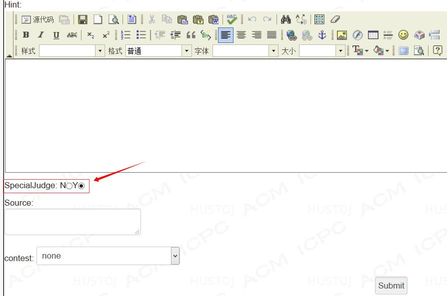

# Special Judge 

### 说明

通常的 ACM 题目包括以下几项内容：题目描述(Description)、输入描述(Input)、输出描述(Output)、样例输入(Sample Input)、样例输出(Sample Out)，在后台则包括测试输入(Input Data)和测试输出(Output Data)两项。在评测用户提交的程序正确与否时，系统会将样例输入和测试输入重定向作为程序的标准输入，通过判断程序对应的输出是否与期待的输出完全相同，来判断解答是否正确。

对于同一道题目，用户可能使用各种不同的方法来解答，所以对于某些特殊的题目，其结果可能不唯一，但都符合题目要求。此类题目就需要进行特判(Special Judge)。HUSTOJ 便提供了特判功能。

这些题目主要有：

1、答案不唯一。见下例一。

2、控制精度。题目要求输出精度在某 `eps` 之内。见下例二。

3、其他。

`spj` 的文件可以是 `c` 或 `cpp` 编写的程序，编译为 `spj` 文件，并设执行权限。

`spj.c` 或 `spj.cc`，需编译为 `spj` ，执行 `spj` 时传 3 个文件名参数：输入，参考输出，用户输出。

`spj.c` 或 `spj.cc` 应放置于对应题目测试数据目录下，导出题目时将自动导出。执行判定是自动的。

`spj` 的退出值决定判断结果，成功退出 `0` 表示 `AC` ，其余表示 `WA` 。

把 `spj` 本身看做一道题目，输入是前述三个文件，输出是程序退出时的返回值，返回值是 `0` 表示 `AC` ，非零表示 `WA`。

可以到 `freepeoblemset` 找到标有 `spj` 的题目下载。

### Special Judge 在 HUSTOJ 中的使用

1．在题目后台编辑页面启用该选项



2．编制 `data.in` 、`data.out`、`spj.cc`（或 `spj.c`）。

3．编译出spj，设执行权限，连同2 中的三个文件一起上传至服务器。

### 例子

**1．A+B spj.c**

```c
#include<stdio.h>
int main(int argc, char *args[]) {
    FILE * f_in   = fopen(args[1],"r");
    FILE * f_out  = fopen(args[2],"r");
    FILE * f_user = fopen(args[3],"r");
    int ret = 0;
    int a, b, c;
    while(fscanf(f_in,"%d %d",&a, &b) != EOF) {
        fscanf(f_user, "%d", &c);
        if(a + b != c) {
            ret = 1; 
            break;
        }
    }
    fclose(f_in);
    fclose(f_out);
    fclose(f_user);
    return ret;
}
```

**2．给出一个不小于 12 的正整数n，请你输出两个合数，使他们的和等于n。**

分析题意，可以得出系统判断用户输出是否正确的两个条件是：输出的两个数是否均为合数；输出的两个数之和是否为n。

首先分别制定data.in（测试输入）、data.out（测试输出）如下：

filename: data.in
```
1
2
3
4
3
12
15
1000
```

filename: data.out
```
1
2
3
8 4
9 6
500 500
```

然后编写 `spj.cc` （特判程序）。HUSTOJ 中的 `spj.cc` 需要有 3 个文件名参数传入：测试输入、测试输出、用户输出。`spj` 的返回值决定着判断结果，成功返回 `0` 表示 `AC` ，其他非零值表示 `WA` 。

下面给出一个本题 `spj.cc` 的示例代码。

```c
#include <stdio.h>
bool is_prime(int x) {
    for(int i = 2; i <= n / 2; i++) {
        if(n % i == 0) {                   //符合该条件不是素数
            return true;
        }
    }
}
int main(int argc, char *args[]) {
    FILE * f_in   = fopen(args[1], "r");    //测试输入
    FILE * f_out  = fopen(args[2], "r");    //测试输出
    FILE * f_user = fopen(args[3], "r");    //用户输出
    int ret = 0;                            //返回值
    int T, n, a, b;
    fscanf(f_in, "%d", &T);                 //从输入中读取数据组数T
    while(T--) {
        fscanf(f_in  , "%d"  , &n    );
        fscanf(f_user, "%d%d", &a, &b);
        if(a + b != n || is_prime(a) || is_prime(b))
        ret = 1;                            //Wrong Answer
    }
    fclose(f_in);
    fclose(f_out);
    fclose(f_user);
    return ret;
}
```

编制完 `spj.cc` 后，将这些文件上传至服务器。

登录服务器以后进入 `/home/judge/data/[题号]` 文件夹，执行以下操作，以 `/home/judge/data/1000` 为例：

```bash
sudo vim spj.cc #Edit the file spj.cc
sudo g++ -o spj spj.cc # gcc -o spj spj.c
sudo chmod +x spj
```

测试：

```bash
acm@acm:/home/judge/data/1000$ ./spj data.in data.out data.out
acm@acm:/home/judge/data/1000$ echo $?
0 #Accepted
acm@acm:/home/judge/data/1000$ ./spj data.in data.out data.in
acm@acm:/home/judge/data/1000$ echo $?
1 #Wrong Answer
```

在本地 HUSTOJ 测试，通过网页提交，通过。

**3．经过一定复杂计算后输出一个实数结果，精度要求控制在10−4 内。**

分析题意，可知 `spj` 需要判断测试输出 `a` 与用户输出 `x` 之差是否在 `eps` 之内。

代码如下：

```c
#include <stdio.h>
const double eps = 1e-4;
int main(int argc,char *args[]) {
    FILE * f_in   = fopen(args[1], "r");    //测试输入
    FILE * f_out  = fopen(args[2], "r");    //测试输出
    FILE * f_user = fopen(args[3], "r");    //用户输出
    int ret = 0;                            //返回值
    int T;
    double a, x;
    fscanf(f_in, "%d", &T);                 //从输入中读取数据组数T
    while(T--) {
        fscanf(f_out , "%lf", &a);
        fscanf(f_user, "%lf", &x);
        if(fabs(a-x) > eps) {
            ret = 1;                        //Wrong Answer
        }
    }
    fclose(f_in);
    fclose(f_out);
    fclose(f_user);
    return ret;
}
```